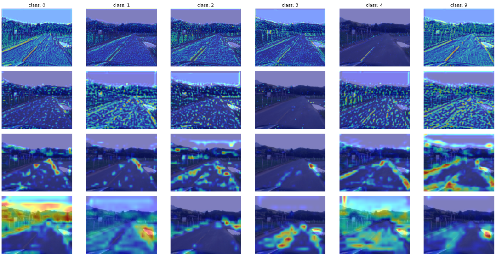
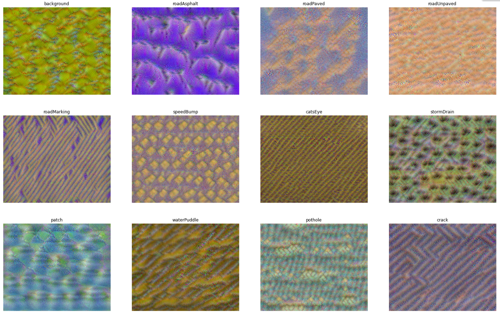
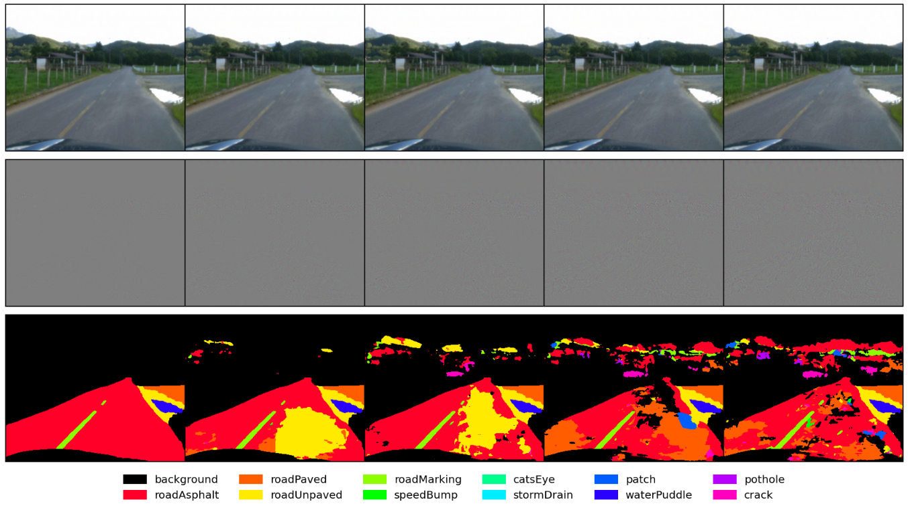
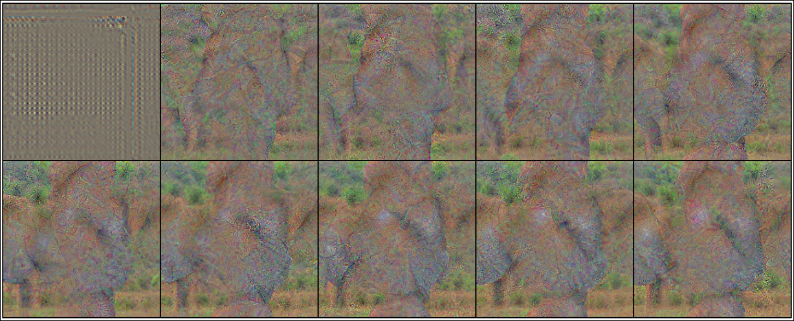
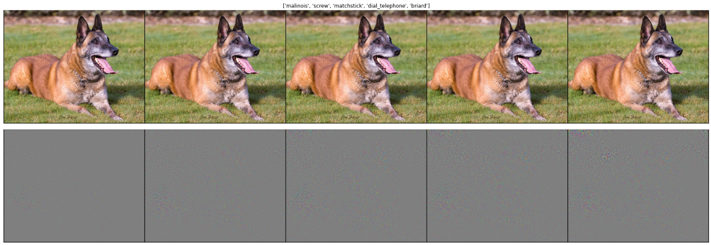

# README 

See the repo tutorial on .

The topics approached on this repo are:
  + Region importance at any layer using [Grad-CAM](https://arxiv.org/abs/1610.02391).
    + With or without guided-backpropagation.
  + Optimize an input to maximize a neuron or an output with gradient ascent.
    + Deep dream, optimization starting from an existing image.
  + Generate adversarial examples.

The results are presented for classification and semantic segmentation.

## Semantic Segmentation 

The images bellow illustrate the RTK Dataset.

### GradCAM

### Input Synthesis

### Adversarial Examples

The rows follows the respective order: the adversarial example, the isolated noised (scaled 3x for better visualization), and the prediction results.

## Classification

The images bellow illustrate the ImageNet.

### GradCAM

### Input Synthesis

### Adversarial Examples

+ The noise was scaled 10x for better visualization. The adversarial predictions were: 'malinois', 'screw', 'matchstick', 'dial telephone', and 'briard'.

## References

+ https://github.com/jacobgil/pytorch-grad-cam/
+ https://aman.ai/cs231n/visualization/
+ http://cs231n.stanford.edu/slides/2021/lecture_14.pdf
+ https://distill.pub/2017/feature-visualization/
